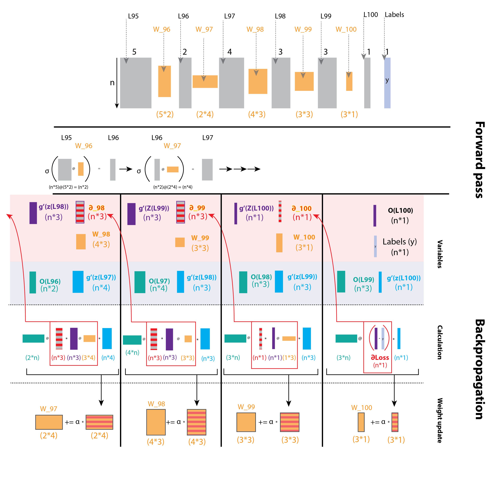
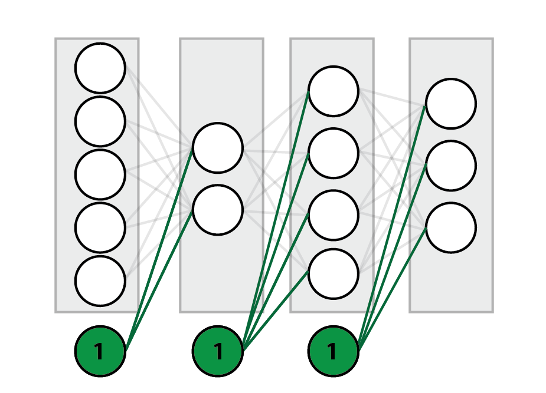

#Backpropagation for people who are afraid of math

Back-propagation is arguably one of the most important concepts in machine learning.
There are many online resources that explain the intuition behind this algorithm (IMO the best of these is the backpropagation lecture in the Stanford [cs231n video lectures](http://cs231n.stanford.edu/ "cs231n course website"). Another very good source, is [this](https://en.wikipedia.org/wiki/Backpropagation)), but getting from the intuition to practice, can be (put gently) quite challenging.  

After spending more hours then i'd like to admit, trying to get all the sizes of my layers and weights to fit, constantly forgetting what's what, and what's connected where, I sat down and drew a diagram that illustrates the entire process. Consider it a visual pseudocode. 

##The Challenge: From intuition to practice
So, assuming you have a good intuitive understanding of what the algorithm should be doing, but have trouble getting it to work, this post is for you!

Now, to be clear, this post will NOT make any attempt to explain the intuition part. As I wrote previously, there are many good and reliable resources that do that. This is a simple (as simple as the algorithm allows..) practical guide to help you get your code to work. In fact, your code will probably work if you follow these steps with no intuition whatsoever. Still, I highly encourage you to read a bit about the [perceptron](https://en.wikipedia.org/wiki/Perceptron) (Note, the perceptron uses a non differentaible step activation function, so you can't really use backpropagation, but its structure, and weights updating method did form the basis for more complex neural networks). This is the bare bone neural network, consisting of only one layer. Understanding how to update the weights in a simple network, is REALLY helpful before jumping into a more complex one. 

When training a network, we repeat the following steps (for *n* epoches): 
  
1. Perform forward pass.  
2. Calculate ∆W (the delta to be added to each weight) via backpropagation.  
3. Update the weights. 

In this articel, I am going to focus on step #2.

Ready?
Let's jump in!  

##Deciphering the equation 
The illustration below is a schematic representation of an arbitrary network. As the process of backpropagation is basically the same for every step (depending on the [activation function](https://medium.com/the-theory-of-everything/understanding-activation-functions-in-neural-networks-9491262884e0) you use). We are only looking at the final layers (You can regard layer L95 as the input layer, if that makes you feel more secure. It makes no difference as far as the calculation is concerned). 

As you can see, our arbitrary network has 5 neurons on layer 95, then 2 neurons on layer 96, then 4, 3, 3, and 1 neuron for the output layer (L100). All layers are connected by weights, marked (traditionally) by lines.  
Notice that each node is separated into *Z* and *O*. For each node, the *Z* values are calculated by multiplying the *O* values of the previous layer, with the weights connecting them with that node. *O* is obtained by applying a non linear activation function on *Z*. Now, below you will find the dreaded gradient calculation. Fear not! We will go over each expression.

When trying to update and optimize the network's weights, we are trying to find  , The derivative of the loss with regard to the weights ("how does a change to the weights effects the loss"), and using the chain rule, divide this task into three:  
 The derivative of the loss with regard to the next layer. This is the loss "passed upstream" from the output layer. or in other words- "How does a change to the next layer, effects the loss".
 
 The derivative of the next layer with regard to the current layer (which can be interpreted as "how a change in the current layer effects the next layer"), which is simply the weights connecting to  the next layer multiplied by the derivative of its activation function. and-  

 - ("How does a change to the weights effect the current layer"), which is the previous layer's *O* values, multiplied by the current layer's activation function derivative.  

To make things clearer, I've written the actual calculations, color coded to our network, for the last two layers of our network, L100 and L99.

  

Notice that the derivative term related to each calculation appears below it. The two derivatives associated with the loss, appearing in red, are of upmost importance, as they are used in the calculations for the previous layers.
This can be seen clearly in the next diagram:

  

Notice how ∂Loss **propagates** down the layers. 
Looking at this pattern, you should start seeing how this could be implemented in code. 
Also notice that I've highlighted the last two layers, which form the before mentioned Perceptron.

Note that I didn’t mention multiplying the entire expression by the learning rate (α) in this diagram, as it seemed too crowded and shadowed the take home messages, which is the application of the chain rule. you should definitely play with different α values to get the best performance. In any case, α does appear in the next diagram. 

##Backpropagating over a batch of instances
An important point to notice is that each layer in the schematic representations we saw, is in fact a vector, representing the computations done for a single instance. Usually we would like to input a batch of instances into the network. This will be clearer after going over the next diagram, which shows the calculation for a batch of *n* instances. Notice that this is the same exact network (5 neurons for layer L95, 2 neurons for layer L96 and so on...), only that we are now looking at n instances and not just one.  
 
The most challenging part for me, when implementing backprop, was to get the sizes of the different layers and weights and gradient matrices to play nice. This illustration aims to set things in order.

On top you will see the schematic network. The actual size of n makes no difference (for the calculations. obviously it does make a difference in the larger scheme of things...), for as you will notice, when we perform matrix multiplications while backpropagating, we always sum over *n*. that is to say, the length of *n* is "lost" during matrix multiplication. And this is exactly what we want, to sum over the loss from all instances in our batch.

The rest of the diagram is divided into two sections: 
 
* Forward pass.
* Backpropagation. 

The forward pass should be pretty obvious to most of you. If it's not, I would recommend reading about matrix multiplications before moving any further.
One thing I will point out is the fact that each weight matrix takes a layer of size *(n,k)* and outputs a layer of size *(n,j)*. such weight matrix will be of size *(k,j)*.  
You will probably notice that this diagram is missing the bias unit. That is because I wanted to keep it as clear as possible, and focus on how the different matrices sizes fit into the backpropagation process. There is a short section on adding the bias unit below.

The backpropagation part is a "bit" trickier... :)  
This section of the diagram is divided in to three sub sections:  

* **Variables** 

	  Here I list the different elements of the calculation, and most importantly, their shape. A few notes on this part:
	  1. *Z* refers to the layer's values before activation. 
	  2. *O* refers to the layer's values after activation. 
	  3. *σ* refers to the activation function.
	  4. *g'* refers to the derivative of the activation function.  
	   
Notice that this section groups the variables constituting  and  at the top, and those constituting  at the bottom. 

* **Calculation**  
This is where all the drama takes place. There is actually nothing new here. These are the same exact calculations seen on the previous diagrams, but with matrix sizes clearly written and depicted. Also, when to use element wise multiplication, and when to use matrix multiplication is clearly stated (matrix multiplication is denoted as @, as this is the shorthand for np.dot. You will see it in action in the code section below) as well as when you need to transpose a matrix. 
The diagram and following code, assumes a squared loss function. Its derivative is defined as `output - labels`.

##Code  
A few notes about this section:  
 
1. For readability purposes, the code presented here is pseudocode.
2. As this post is meant to be used as a practical guide, I encourage you to go over the diagrams and try to write your **own** implementation **before** looking at the code example. The diagrams has all the information you need to successfully build it yourself. Look at the second diagram and see how the gradient is passed from one layer to the next. Look at the third diagram, and make sure you understand what is multiplied by what and what axes are summed over. See how we obtain the shape fitting our layer's weights in each iteration.
3. There are plenty of solutions online. This [one](https://iamtrask.github.io/2015/07/12/basic-python-network/ "A neural network in 11 lines of python") I highly recommend as it is very simple to understand. My own implementation was largely based on it. 
4. The code assumes using the sigmoid activation function. Due to the fact that the derivative of the sigmoid function (`*σ(z) \*1-σ(z)*`) requires only the *O* values, we don't need the neuron's values before activation (*Z*). For implementation using different activation functions, you will need to save the *Z* values when doing a forward pass. 
 
###Using a loop  
	
	
        def train_network(network, iterations, alpha):
            for i in range(iterations):
                # forward
                for layer in network[1:]:
                    layer.nodes = activation_function((layer-1).nodes @ layer.weights)
                # backward
                for layer in network.reverse(): # We iterate our network in reverse order.
                    if layer is output_layer: # Calculate the loss
                        ∂_L =  network[L].nodes - labels
                    elif layer is (output_layer-1): # These are the first weights to be updated (W100 in the diagrams)
                        ∆w.append(alpha * layer-1.nodes.T @ (∂_L * activation_derivative((layer).nodes)))
                    else:
                        ∂_L = ∂_L  @ (layer+1).weights.T * activation_derivative((layer+1).nodes)
                        ∆w.append(alpha * (layer-1).nodes.T @ (∂_L * activation_derivative(layer.nodes)))

            # update weights:
                network.weights += ∆w
            

###Using recurssion

		
		def backprop(current_layer=1):
	    	if current_layer is output_layer:
	       	 	∂_L = current_layer - labels
	       	 	current_layer.∆w = ∂_L * g'(Z(current_layer.nodes)) * (current_layer-1).nodes
	        	return ∂_L
	   		else:
	       	 	∂_L = backprop(current_layer+1)
	       	 	∂_L = ∂_L * g'(Z((current_layer+1).nodes)) * (current_layer+1).W
	        	current_layer.∆w = ∂_L * g'(Z(current_layer.nodes)) * (current_layer-1).nodes
	        	return ∂_L
	        
		layers.W += layers.∆w    

##Adding a bias unit
You may have noticed the previous diagrams were missing the bias units. I chose to leave the bias from these diagrams as I wanted to keep them as simple and intuitive as possible , but you should definitely consider adding it!  
You can add a bias "manually" for each layer, and then calculate the derivative of the loss in respect to that bias:

We already calculated , and  is just the activation function derivative of that layer. 

You could also add the bias to the weights matrix. This basically just means appending a vector of bias neurons (a vector of 1's) to each layer, and initialize the weight matrices shape accordingly (just like you do in simple linear regression). The one thing to keep in mind though, is that the bias units themselves should never be updated in the forward pass, as they are connected to the neurons of the **next** layer, but NOT to the neurons of the **previous** layer (See diagram). 

One way you can approach this is to avoid updating these neurons, but this can get tricky, especially in the backward pass (Full disclosure, this is what I did, and I don't recommend it...). A simpler solution is to do the forward and backward pass normally, but re-initialize the bias neurons to 1 after each layer update.

##Some useful tips
* Do **NOT** update the weights while back-propagating!! Remember that the next iteration will need these (non-updated) weights to compute the loss. You can either save the ∆w's, and update the weights at the end of the loop (like I'm doing in the code examples), or constantly update the weights two layers ahead, which I think is way more confusing.. 
* Be aware that the larger and more complex your network is, the more iterations it will need in order to converge and output a value resembling your true values. So don't be surprised if you add a layer or two and suddenly your network performs poorly.   
* If a layer is not activated by a non-linear function (for example the output layer), the gradient is just 1.
* The fact that your program doesn't crash, doesn't mean it works. make sure your network converges, and that the loss decreases.
* The fact that your network converges and your loss decreases, doesn't mean it's working optimally. compare your results to other implementations. play around with the learning rate, and the structure of the network.
* Try different initialization methods for the weights. This can have a **huge** effect on performance.

## Summary
Backpropagation is a tough nut to crack, but if you wish to have a good understanding of how neural networks work, you should avoid jumping into high level solutions such as [TensorFlow](https://www.tensorflow.org/tutorials/) or [Pytorch](https://pytorch.org/) before implementing a simple network yourself. This is the basis for all deep learning and is [crucial](https://medium.com/@karpathy/yes-you-should-understand-backprop-e2f06eab496b) for successfully working with more complicated networks. 
It's also fun (when it works). 

Good luck!

   

 Michael Chein 03/02/2019 

#notes
* the formulas are in low res. 

